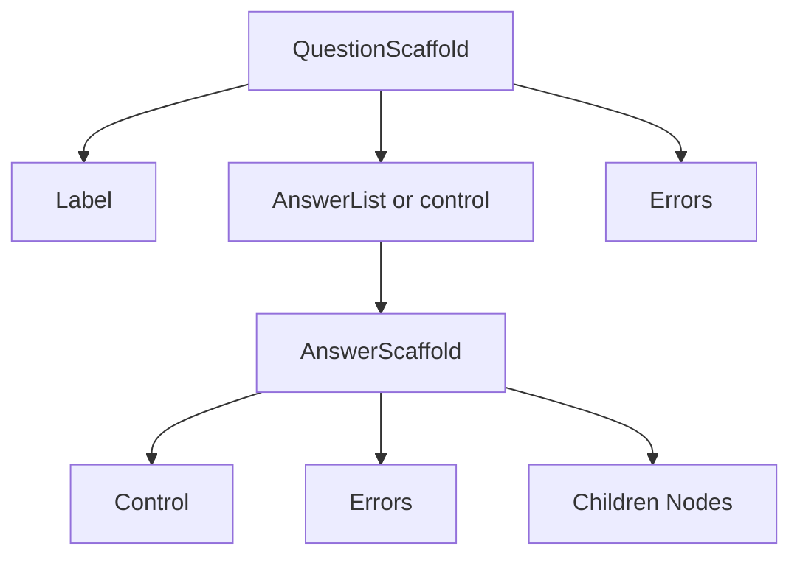
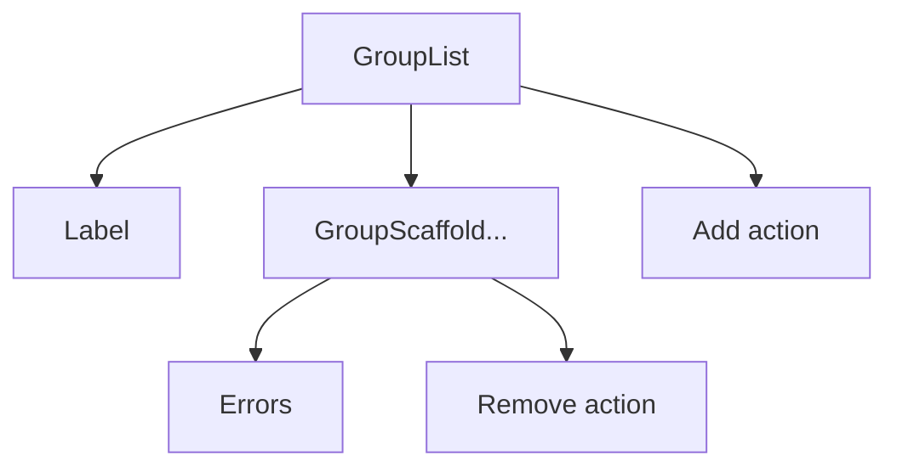

This package defines the theme contract for Formbox Renderer. Use it when you build a theme or want strict typing while customizing an existing theme.

## Install

If you only need types in an app, install as a dev dependency:

```bash
pnpm add -D @formbox/theme
```

If you are publishing a theme package, add it as a dependency:

```bash
pnpm add @formbox/theme
```

## Quick start

Create a theme by implementing the `Theme` contract. The easiest path is to start from an existing theme and override the components you want to replace.

```tsx
import type { Theme } from "@formbox/theme";
import Renderer from "@formbox/renderer";
import { theme as baseTheme } from "@formbox/hs-theme";

const theme: Theme = {
  ...baseTheme,
  Label: MyLabel,
};

<Renderer fhirVersion="r5" questionnaire={questionnaire} theme={theme} />;
```

## Theme contract

A `Theme` is a full object with React components for every slot listed in the reference. The renderer never touches DOM APIs directly; the theme owns markup, layout, and styling. Data flows only through props.

The `Theme` type is strict. You must supply every component, either by building a complete theme from scratch or by extending a base theme.

## Conventions

- Inputs are controlled. Callbacks receive values, not DOM events.
- Use `disabled` to indicate non-editable state; avoid `readOnly` unless your component needs it.
- `ariaLabelledBy` and `ariaDescribedBy` are id strings. Forward them directly to the focusable element.
- When `id` is provided, apply it to the primary focusable element.
- `children` is the slot for rendered content. Option types use `label` for display content.
- When a prop is optional, the renderer may omit it. Treat `undefined` as not provided.

## Renderer composition overview

The renderer composes your theme in a predictable tree. You control layout, but the nesting describes where headers, errors, and actions appear.

Overview diagram (simplified):



Group list composition for repeating groups:



Typical question node:

```text
QuestionScaffold
  Label
  AnswerList (or a single control)
    AnswerScaffold (per answer)
      control (TextInput/Select/etc.)
      remove action (when onRemove is provided)
      children (nested nodes)
      errors (Errors)
  Errors (question-level)
```

Typical repeating group list:

```text
GroupList
  Label (only when list has text)
  GroupScaffold (per instance)
    remove action (when onRemove is provided)
    errors
  add action (when onAdd is provided)
```

Typical non-repeating group:

```text
GroupScaffold
  Label (when visible)
  Stack (child nodes)
  Errors
```

## Renderer guarantees

- `id`, `ariaLabelledBy`, and `ariaDescribedBy` values are unique within a render and stable for a given node or answer.
- `ariaDescribedBy` strings are already space-joined; use them as-is.
- Option tokens are stable across renders; selected options may remain when the options list changes.
- When needed, the renderer passes disabled legacy options so stored answers still render.
- `label` and `children` props are ready-to-render `ReactNode` values.

## Next

See `reference.md` for component props and `behavior.md` for runtime behavior details.
